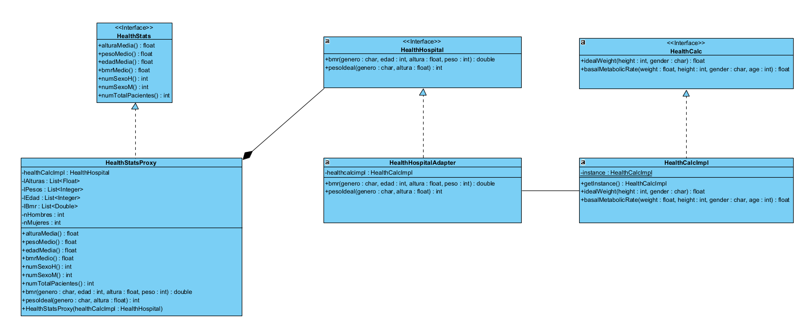

# isa2024-healtcalc
Health calculator
# Casos de prueba para la calculadora

## Tests para el método *idealBodyWeight(int height, char gender): float*:

### · Test de entrada de altura negativa: En el caso de especificar una entrada de altura negativa, se espera un error saltando una excepción.

### · Test de entrada de género erróneo: En el caso de especificar una entrada de género diferente a las esperadas "H" o "M", se espera un error saltando una excepción.

### · Test de entrada de altura mínima: En el caso de especificar una entrada de altura inferior a 0.5m, se espera un error saltando una excepción.

### · Test de entrada de altura máxima: En el caso de especificar una entrada de altura superior a 2.72m, se espera un error saltando una excepción.

### · Test de uso estándar en hombres: En el caso de especificar entradas estándares con el género masculino, se espera evaluar el resultado.

### · Test de uso estándar en mujeres: En el caso de especificar entradas estándares con el género femenino, se espera evaluar el resultado.

## Test para el método *basalMetabolicRate(float weight, int height, char gender): float*:

### · Test de entrada de peso negativo: En el caso de especificar una entrada de peso inferior a 0, se espera un error saltando una excepción.

### · Test de entrada de peso mínimo: En el caso de especificar una entrada de peso inferior a 15kg, se espera un error saltando una excepción.

### · Test de entrada de peso máximo: En el caso de especificar una entrada de peso superior a 500kg, se espera un error saltando una excepción.

### · Test de entrada de altura negativa: En el caso de especificar una entrada de altura negativa, se espera un error saltando una excepción.

### · Test de entrada de altura mínima: En el caso de especificar una entrada de altura inferior a 0.5m, se espera un error saltando una excepción.

### · Test de entrada de altura máxima: En el caso de especificar una entrada de altura superior a 2.72m, se espera un error saltando una excepción.

### · Test de entrada de género erróneo: En el caso de especificar una entrada de género diferente a las esperadas "H" o "M", se espera un error saltando una excepción.

### · Test de uso estándar en hombres: En el caso de especificar entradas estándares con el género masculino, se espera evaluar el resultado.

### · Test de uso estándar en mujeres: En el caso de especificar entradas estándares con el género femenino, se espera evaluar el resultado.

### · Test de edad errónea: En el caso de especificar una entrada de edad inferior a 0 o superior a 100, se espera un error saltando una excepción.

## Captura de pantalla del resultado de ejecutar los tests

###

## Captura de pantalla del registro de instantáneas (commits) que he ido realizando durante el desarrollo de la práctica:

###     

# Práctica 2

###

## Especificación de caso de uso BMI

###

Nombre: Calcular BMI

Actor principal: Usuario

Ámbito: Aplicación // Calculadora de la salud

Nivel: Summary

Stakeholders e intereses:

	- Usuario: Poder realizar el cálculo de su índice de masa corporal
	
	- Personal sanitario: Poder realizar seguimiento al paciente

Precondiciones:
	
	- El usuario tiene acceso a la aplicación de la calculadora de salud.
	
	- El usuario tiene los datos necesarios para calcular el índice de masa corporal (BMI), como peso y altura.

Garantías mínimas:

	- La aplicación debe proporcionar una interfaz clara y fácil de usar para que el usuario pueda introducir su peso y altura.

	- La aplicación debe realizar correctamente el cálculo del índice de masa corporal (BMI) utilizando la fórmula estándar.

	- La aplicación debe mostrar el resultado del cálculo del BMI de forma clara y legible para el usuario.

Garantía de éxito:

	- El usuario puede calcular con éxito su índice de masa corporal (BMI) 
utilizando la aplicación de la calculadora de salud.

Escenario principal:

	- El usuario abre la aplicación de la calculadora de salud.

	- El usuario selecciona la opción de "Calcular BMI" desde la interfaz de la aplicación.

	- El usuario introduce su peso y altura en los campos correspondientes.

	- La aplicación realiza el cálculo del índice de masa corporal (BMI) utilizando la fórmula estándar: BMI = peso (kg) / (altura (m))^2.

	- La aplicación muestra el resultado del cálculo del BMI al usuario.

Escenarios alternativos:

	- Si el usuario no introduce valores válidos para el peso y la altura (por ejemplo, valores negativos o cero), la aplicación muestra un mensaje de error y solicita al usuario que introduzca valores válidos.

	- Si la aplicación encuentra algún error durante el cálculo del BMI, muestra un mensaje de error indicando que no se puede calcular el BMI en este momento y solicita al usuario que lo intente de nuevo más tarde.

Extensiones:

	- La aplicación permite al usuario guardar los resultados del cálculo del BMI para su referencia futura.

	- La aplicación proporciona consejos o recomendaciones de salud basadas en el resultado del cálculo del BMI, como sugerencias para mejorar la dieta o aumentar la actividad física si el BMI está fuera del rango saludable.

    
# Práctica 3

Historias de usuario:

· Cálculo del peso ideal de una persona:

Como usuario de la calculadora de salud, quiero poder calcular el peso ideal de una persona para ayudar a establecer objetivos de peso saludables.

- Criterios de aceptación:

Se deben proporcionar dos opciones para seleccionar el género: masculino y femenino.

El usuario debe poder ingresar la altura de la persona en centímetros.

Al presionar el botón de calcular, la calculadora debe mostrar el peso ideal de la persona en kilogramos con dos decimales de precisión.

El cálculo del peso ideal debe basarse en la fórmula de Lorentz para hombres y mujeres.

- Escenario 1: Calculando el peso ideal para una persona de sexo masculino.

Dado que ingreso la altura de la persona como 175 cm.

Cuando selecciono el género masculino y presiono el botón de calcular.

Entonces la calculadora muestra que el peso ideal para la persona es de aproximadamente 68.75 kg.

- Escenario 2: Calculando el peso ideal para una persona de sexo femenino.

Dado que ingreso la altura de la persona como 155 cm.

Cuando selecciono el género femenino y presiono el botón de calcular.

Entonces la calculadora muestra que el peso ideal para la persona es de aproximadamente 53 kg.

· Cálculo de la tasa metabólica basal de una persona:

Como usuario de la calculadora de salud, quiero poder calcular la tasa metabólica basal (TMB) de una persona para estimar sus necesidades calóricas diarias.

- Criterios de aceptación:

Se debe proporcionar una opción para seleccionar el género: masculino o femenino.

El usuario debe poder ingresar la edad de la persona en años, el peso en kilogramos y la altura en centímetros.

Al presionar el botón de calcular TMB, la calculadora debe mostrar la tasa metabólica basal (TMB) de la persona en kilocalorías por día (kcal/día) con dos decimales de precisión.

El cálculo de la TMB debe basarse en la fórmula específica para hombres y mujeres según los estándares de salud.

- Escenario 1: Calculando la TMB para una persona de 80 años de edad, 90 kg de peso, 167 cm de altura y sexo masculino.

Dado que ingreso la edad de la persona como 80 años, el peso como 90 kg y la altura como 167 cm.

Cuando selecciono el género masculino y presiono el botón de calcular TMB.

Entonces la calculadora muestra que la TMB para la persona es de aproximadamente 1548.75 kcal/día.

- Escenario 2: Calculando la TMB para una persona de 25 años de edad, 60 kg de peso, 150 cm de altura y sexo femenino.

Dado que ingreso la edad de la persona como 25 años, el peso como 60 kg y la altura como 150 cm.

Cuando selecciono el género femenino y presiono el botón de calcular TMB.

Entonces la calculadora muestra que la TMB para la persona es de aproximadamente 1251.50 kcal/día.

# Práctica 4

## Interfaz gráfica de usuario

## Boceto de interfaz

## Resultado final de interfaz

## Práctica 6 

## Patrones de diseño

